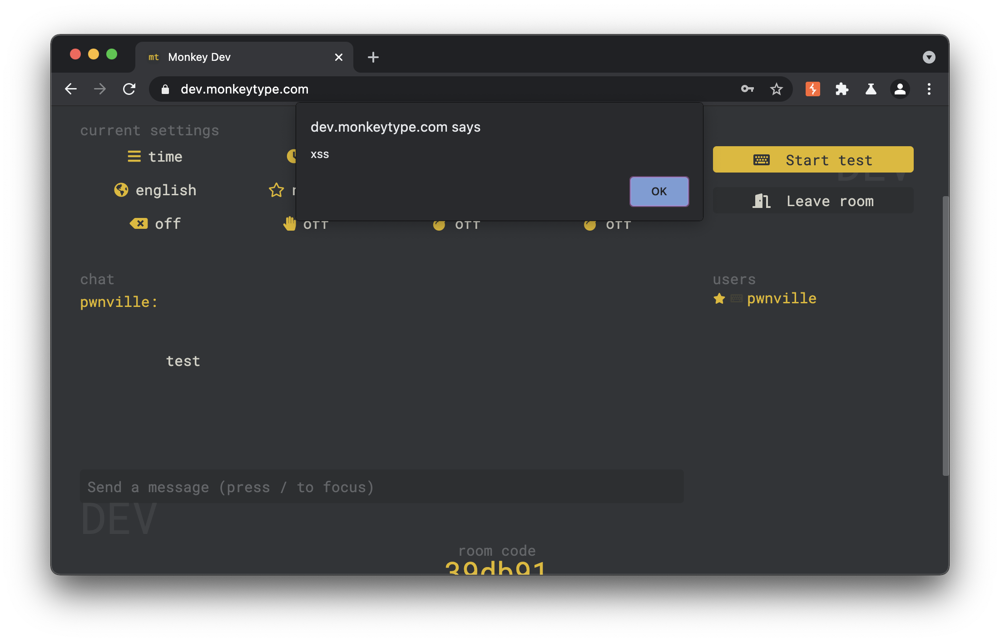
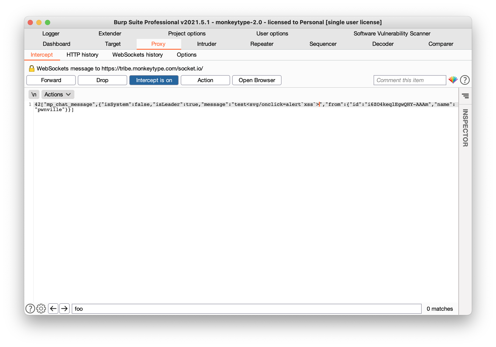
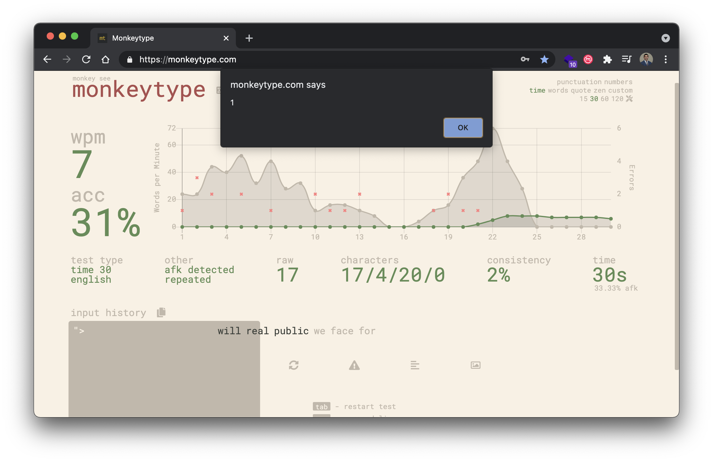
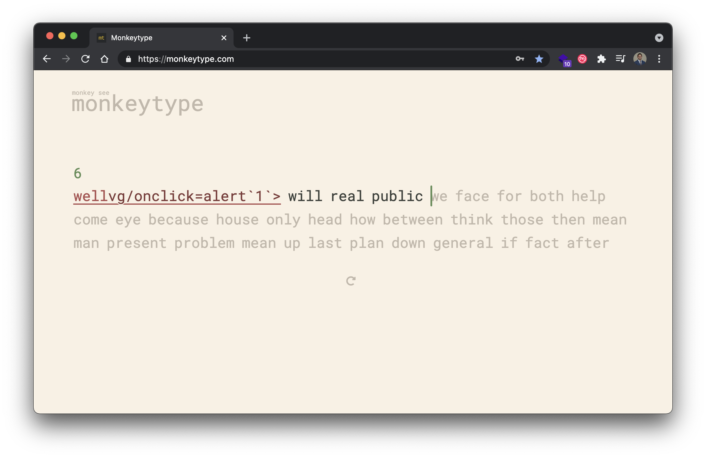
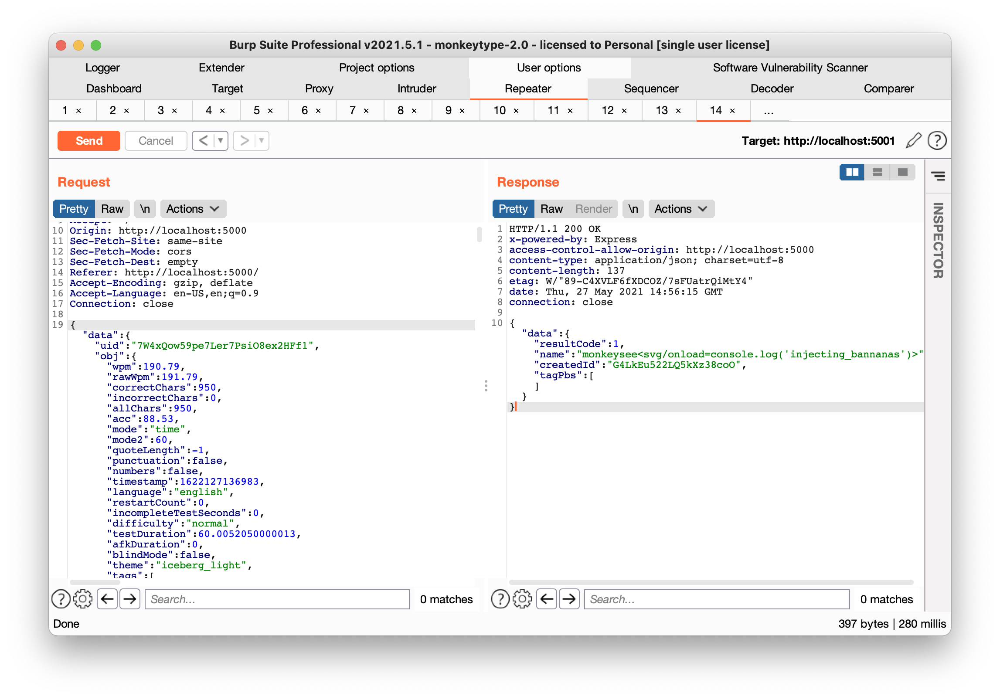

```
                                                          .="=.
                                                      _/.-.-.\_     _
                                                      ( ( o o ) )    ))
                                                      |/  "  \|    //
                                      .-------.        \'---'/    //
                                      _|~~ ~~  |_       /`"""`\\  ((
                                  =(_|_______|_)=    / /_,_\ \\  \\
                                      |:::::::::|      \_\\_'__/ \  ))
                                      |:::::::[]|       /`  /`~\  |//
                                      |o=======.|      /   /    \  /
                                      `"""""""""`  ,--`,--'\/\    /
                                                  '-- "--'  '--'
                                     Vulnerability Research by Tyler Butler 🍌 
```


# Monkey See Monkey Do 🙈
This repository contains original vulnerability research on [MonkeyType](https://monkeytype.com/), a popular typing-test web application with a growing online community. The current research includes several cross-site scripting vulnerabilities. All issues were disclosed to the vendor according to the vendor's [guidance](https://github.com/Miodec/monkeytype/blob/master/.github/ISSUE_TEMPLATE/bug_report.md) as GitHub issues, as well as on the discord channel.  


**Table of Contents**
- [Identified Vulnerabilities](#identified-vulnerabilities)
  - [Stored Cross-Site Scripting (XSS) via Tribe Chat](#stored-cross-site-scripting-xss-via-tribe-chat)
  - [Self Cross Site Scripting (XSS) via Word History](#self-cross-site-scripting-xss-via-word-history)
- [MonkeySee](#monkeysee)
  - [What is it?](#what-is-it)
  - [How does it Work?](#how-does-it-work)


# Identified Vulnerabilities

> The following section describes publically disclosed vulnerabilities
## Stored Cross-Site Scripting (XSS) via Tribe Chat 


### Overview

The MonkeyType Tribe chat at https://dev.monkeytype.com/tribe is vulnerable to stored cross-site scripting through user comments and username. The research concludes that input validation can be evaded by intercepting raw web socket traffic, and injecting payloads directly into message content. To do so, malicious users can enter a non-xss string in the chat field and send it to web server, then capture the web socket traffic with a proxy tool like BurpSuite, and finally modify the input to a XSS payload.

### Payload   

In this example, I used an `onclick` payload to demonstrate the capability. The final payload was ```test<svg/onclick=alert`xss`>```

**Socket Message**

```json
42["mp_chat_message",{"isSystem":false,"isLeader":true,"message":"test<svg/onclick=alert`xss`>","from":{"id":"i6ZO4keqlEgwQHY-AAAm","name":"pwnville"}}]
```




### To Reproduce

+ Configure [BurpSuite](https://portswigger.net/burp) to intercept browser traffic
+ Navigate to https://dev.monkeytype.com/tribe
+ Click on "create room"
+ Turn on BurpSuite proxy interception
+ Enter a new chat string
+ Intercept the web socket traffic, and chang the chat string to an XSS payload, example below.

```json
42["mp_chat_message",{"isSystem":false,"isLeader":true,"message":"test<svg/onclick=alert`xss`>","from":{"id":"i6ZO4keqlEgwQHY-AAAm","name":"pwnville"}}]
```





## Self Cross Site Scripting (XSS) via Word History



### Overview   

User input is interpreted by the browser unsanitized when entered into the typing challenge. Once the challenge is over and the user opens the "word history" tab, hovering over the mispelled words will cause the browser to interpret the payload as valid injected code. Under current limitations significant code execution cannot be caused due to character limit, however more research should be done to prove impact. This occurs in default settings.

### To Reproduce 

For a XSS payload, just start typing the following upon immediatly starting a new typing test ```"><svg/onclick=alert1`>```

+  Start a new typing challenge
+  Spell the first word correctly, then immediately after the first word and with no spaces after, terminate the string with ">
+  Enter payload
+  Once the timer is complete, select the option to view word history
+  Hover over the misspelled word, and the payload will execute




# MonkeySee 
## What is it? 
Monkey See is a quick proof of concept to show how any user can enter the daily and global leaderboards of [MonkeyType](https://monkeytype.com) by sending carefully crafted post requests to the firebase server. 

## How does it Work?  

Monkey see works by creating a new post request and changes the `wpm`, `rawwpm`, `correctChars`, `incorrectChars`, and `allChars` parameters. Back-end logic checks to make sure that the wpm matches the total number of correctChars, so it's important to keep these consistent. For example, to create a new score with 195 words per minuet, the following parameters were used.

**Mode 15**

```json
"wpm":195.17,
"rawWpm":195.17,
"correctChars":242,
"incorrectChars":1,
"allChars":243,
```

**Mode 60**

```json
"wpm":190.79,
"rawWpm":191.79,
"correctChars":950,
"incorrectChars":0,
"allChars":950,
```


